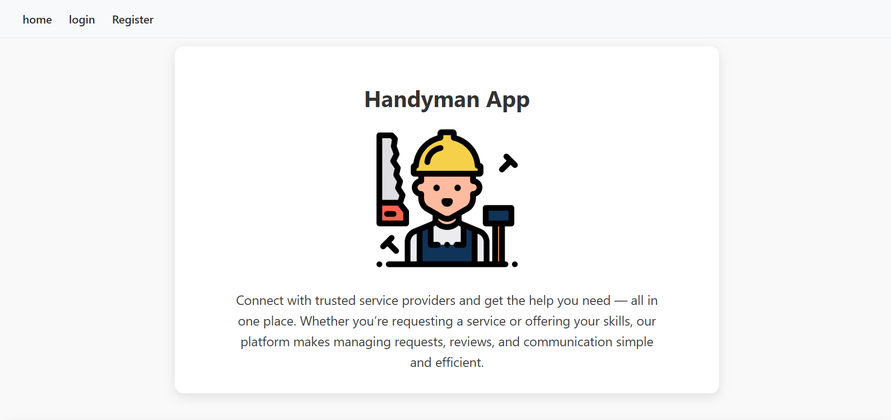

## Handyman MERN-Stack Application

### 👤 Members

Created by Alya Alaali | Mohamed Rashad | Abdulaziz Alabdulla

### Deployment
Deployed using Surge on handyman.surge.sh

## 📜 Description

Handyman is a dynamic online services marketplace that seamlessly connects users with experienced service providers. Whether you want to get work done or offer your professional expertise, the site provides an easy-to-use, secure, and interactive environment.

You can view our app here: [Handyman!](https://thisjustaplaceholder)

## 🔖 Technologies used

- **Front-end:** React
- **Back-end:** express, MongoDB, NodeJS

## 📊 Project Plan

- **Component Hierarchy Diagram** 

- **Entity Relationship Diagram** 

##### Figma Wireframes: [Handyman!](https://www.figma.com/design/K3EkViLOZxOcrU9VUDjuq9/Handyman?node-id=0-1&p=f&t=VXM9YghfTG9pi44E-0)

##### Trello Board: [Handyman!](https://trello.com/b/R97Ba7Lh/handyman-project)

##### Backend Repo: [Handyman!](https://github.com/alyaalaali/Handyman-app-BE)

---

### Future Enhancement

- live chats between user and provider
- notification center
- provider search bar

---

### Attributions

1. [star rating](https://medium.com/@ccchimento/user-ratings-with-javascript-and-react-c33e1a3137bc)
2. [category selection](https://stackoverflow.com/questions/66624289/how-to-handle-the-the-onclick-events-on-checkbox-in-react-js)

3. I’d also like to thank our instructor associate, Zainab, for her help and support with this project.
